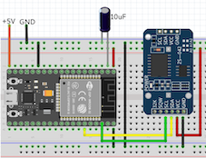

# NodeMCU32s and DS3231 RTC I2C

ESP-IDF example for DS3231 RTC.

All codes have been written using VSCODE + PlatformIO IDE (Core 6.1.5, Home 3.4.3) + Espressif 32 (5.2.0).

and using examples from: https://github.com/UncleRus/esp-idf-lib

For testing I used this connection.

